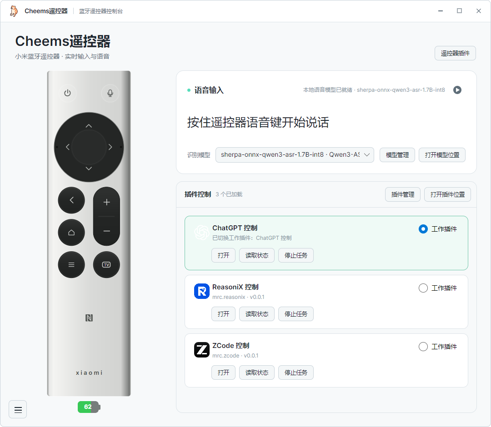

# Cheems遥控器

Cheems遥控器（MiRemoteControl）是一个 Windows 桌面应用：把小米蓝牙遥控器变成 AI 编程工具的控制器，按住语音键说话，看着 TV 大屏提交。

- 🎮 小米蓝牙遥控器实时控制（方向、确认、电源、音量、TV 大屏）
- 🎙 中文语音输入（Qwen3-ASR / Whisper / SenseVoice，应用内下载模型）
- 🧩 插件市场——被控端插件（ZCode / ChatGPT / ReasoniX…）与应用本身解耦，云端下载更新
- ⌨️ `mrc` 命令行，全部命令支持 `--json`，适合脚本与 AI 自动化

